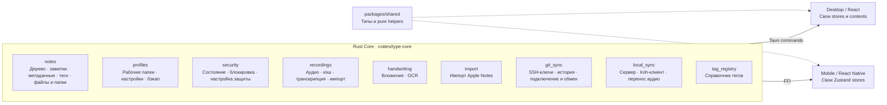
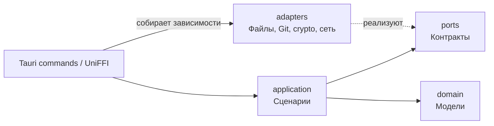
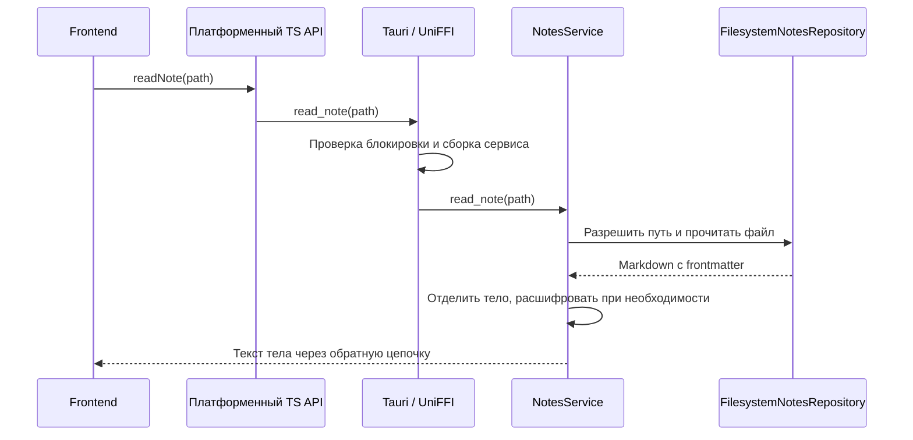

# 12. Карта Rust Core и двух приложений

Снимок кода на 2026-09-16. Это карта текущей реализации; общий JS state-слой
из [главы 13](./13-shared-stores-proposal.md) пока является предложением.

## Как сейчас

Слева — общее ядро, справа — приложения. Стрелки показывают, через какую
границу приложение получает доступ к ядру, а не направление вызова:
обычно запрос начинает frontend. «Общее» означает общий исходный код;
на каждом устройстве работают свой экземпляр ядра и свои локальные файлы.

Полные списки функций намеренно вынесены из обзорной схемы:

- [Каталог всех функций, подгрупп и платформ](./14-exposed-api-catalog.md).
- [Полная текущая схема в Markdown](./diagrams/current-full-api.md).
- [Полная предлагаемая схема в Markdown](./diagrams/proposed-full-api.md).
- [Детальная текущая схема, исходник Mermaid](./diagrams/current-full-api.mmd).
- [Детальная предлагаемая схема, исходник Mermaid](./diagrams/proposed-full-api.mmd).

Файлы `.mmd` — текстовые, их можно редактировать и открывать в Mermaid-совместимом
просмотрщике. Они содержат полный API, вертикальные списки функций и подгруппы,
как подробные иллюстрации. Для первого знакомства удобнее обзор выше;
для поиска конкретного метода — каталог. Порядок и размещение блоков в Mermaid
выбирает renderer, поэтому пиксельное совпадение с рисунком не предполагается.
В соседних `.md` находится тот же Mermaid-блок для просмотра на GitHub;
при правках обновляйте обе формы вместе.

## Что означает «домен»

В `application/` девять модулей: `notes`, `profiles`, `security`, `recordings`,
`handwriting`, `import`, `git_sync`, `local_sync`, `tag_registry`.
Функциональный домен обычно проходит через несколько слоёв:

`domain/` сейчас содержит модели `notes` и `tag_registry`, а не по файлу на
каждый функциональный домен. У `NotesService` содержательная логика сценариев;
большинство остальных application-сервисов делегируют работу gateway-адаптерам.
Часть внешних функций обращается к реализации напрямую, например Iroh и импорт
аудио. Диаграмма слоёв показывает основной принцип, не обязательный маршрут
каждой команды.

Подгруппы внутри домена — группировка по назначению, не обещание отдельных
Rust-модулей. Например, `notes / Файлы и папки` включает операции, принимающие
оба типа элементов. Отдельной команды `create_folder` нет: папки создаются при
`create_note` и `move_items`.

Чтобы не вводить отдельный визуальный раздел «Инфраструктура», на карте:

- функции `iroh_sync` отнесены к `local_sync`;
- `prune_mobile_audio_cache` отнесена к `recordings`;
- `set_app_icon` и `init_core` показаны рядом с оболочками.

Физически код остаётся в своих модулях. `whisper_env` и `ocr_env` поддерживают
транскрипцию/OCR, но не имеют самостоятельных экспортов Tauri/UniFFI.

## Один запрос: чтение заметки

Frontend решает, какой экран показать, как хранить loading/error и когда
обновлять кэш. Rust отвечает за чтение, файловые правила и защиту данных.
Это и есть место для возможного общего JS state-слоя.

## Что общее на TypeScript сейчас

`packages/shared` содержит типы, разбор Markdown/frontmatter и превью, теги,
фильтры, sync links и другие функции без платформенных зависимостей.
Общего пакета stores пока нет. `packages/mobile-core` — мобильный мост,
а не общий state-слой двух приложений.

На desktop состояние распределено между `app/state`, feature contexts и hooks;
на mobile — преимущественно между `src/state/*-store.ts`.
Слово `shared` в имени desktop-хука ещё не означает совместное использование
с mobile: например, processing queue plumbing сейчас живёт внутри desktop
и использует `window`.

## Где смотреть реализацию

| Граница | Исходник |
|---|---|
| Домены application | [application/mod.rs](../../crates/type-core/src/application/mod.rs) |
| Зарегистрированные desktop-команды | [commands/mod.rs](../../apps/desktop/src-tauri/src/commands/mod.rs) |
| Мобильные экспорты и init | [type-ffi/src/lib.rs](../../crates/type-ffi/src/lib.rs) |
| Desktop notes API | [notes-api.ts](../../apps/desktop/src/features/notes/api/notes-api.ts) |
| Mobile typed API | [core-api.ts](../../packages/mobile-core/src/core-api.ts) |
| Mobile bridge contract | [raw-core.ts](../../packages/mobile-core/src/raw-core.ts) |
| Общее TS | [packages/shared](../../packages/shared) |

При добавлении функции обновляются каталог и детальные схемы вместе с
оболочками; порядок изменения кода описан в [главе 09](./09-adding-features-and-codegen.md).
