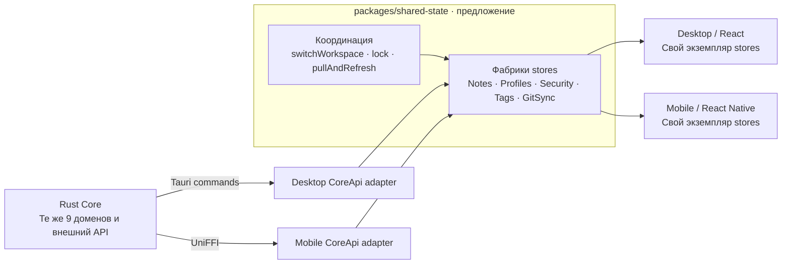

# 13. Предложение: общий JS state-слой

Статус: **предложение, не реализовано**. Зафиксировано 2026-09-16.
Имена пакета, stores и методов ниже — целевой дизайн, а не существующие экспорты.
Текущая архитектура и полный внешний Rust API — в [главе 12](./12-architecture-map.md)
и [каталоге](./14-exposed-api-catalog.md).

## Зачем это делать

Да, часть stores стоит сделать общей. `read_note` уже реализована один раз в
Rust, но frontend отдельно решает, как загрузить заметку, показать loading/error,
обновить превью после записи и не применить ответ от прежней рабочей папки.
Именно эти правила можно переиспользовать.

Есть конкретные места для сближения:

- Mobile [notes-store.ts](../../apps/mobile/src/state/notes-store.ts) хранит дерево,
  превью и операции перемещения/удаления; desktop распределяет близкую логику между
  [tree actions](../../apps/desktop/src/features/notes/navigation/state/use-notes-tree-actions.ts)
  и [preview cache](../../apps/desktop/src/features/notes/list/hooks/use-note-previews.ts).
- Mobile [settings-store.ts](../../apps/mobile/src/state/settings-store.ts) и desktop
  [profile actions](../../apps/desktop/src/features/profiles/hooks/use-profile-actions.ts)
  работают с одним Rust snapshot профилей, но отдельно реализуют обновления.
- Состояние security и базовые Git-операции также дублируются. Мобильный sync-store
  дополнительно содержит Iroh, перенос аудио и autosync; это не основание переносить
  весь файл в shared.

Store не должен быть копией списка Rust-функций. Для единичной операции без
переиспользуемого состояния достаточно API/service. В частности, бэкап и импорт
не требуют отдельного общего store только потому, что у них есть команды.

## Предлагаемая архитектура

Схема читается слева направо как доступ к данным. Общий прямоугольник означает
общий **код**, а не один процесс или общее состояние между устройствами.



[Детальная схема с полным API и подгруппами](./diagrams/proposed-full-api.mmd).
Синхронизация данных между устройствами по-прежнему принадлежит Rust/Git/Iroh.

## Пакет и зависимости

Предлагаемая структура:

```text
packages/shared/                 существующие типы и pure helpers
packages/shared-state/src/
  api/                          NotesApi, ProfilesApi, SecurityApi, ...
  stores/                       фабрики отдельных stores
  workflows/                    операции между несколькими stores
  react/                        тонкие React bindings, если нужны

apps/desktop/src/.../            адаптер контрактов через Tauri
apps/mobile/src/.../             адаптер через mobile-core/core-api
```

Основа — независимые от React фабрики Zustand stores. React и React Native
подписываются через тонкие bindings. `packages/shared` остаётся без React/Zustand;
зависимость направлена из `shared-state` в `shared`, а не обратно.

Общий код не импортирует `apps/*`, Tauri, Expo, `window`, `localStorage`, native
bindings или сгенерированный TurboModule. Адаптеры нормализуют аргументы, JSON,
результаты и ошибки; frontend не видит транспортные детали.

Концептуальный wiring, не готовый к вставке API:

```ts
// В composition root desktop:
const stores = createStores({ api: tauriCoreApi });

// В composition root mobile:
const stores = createStores({ api: ffiCoreApi });
```

`CoreApi` — набор небольших интерфейсов по доменам. Не нужно принуждать mobile
реализовывать desktop OCR или desktop — мобильный Iroh-клиент. Такие возможности
подключаются отдельными capability-интерфейсами и остаются вне общего минимального
контракта. Неподдерживаемый метод нельзя маскировать успешной пустой реализацией.

## Какие stores и методы

Все параметры `Args`, patch и результаты используют существующие wire-типы из
`packages/shared`, либо явно нормализованный TS-контракт. Ниже перечислены
предлагаемые публичные действия; служебные `reset()` сбрасывают только JS-состояние.

### NotesStore — первый этап

Состояние: `tree`, `notesByPath`, `previewsByPath`, loading/error по ресурсу,
текущий scope рабочей папки. Сохранённый текст и редактируемый черновик — разные
сущности: background refresh не должен затирать ввод пользователя.

| Группа | Методы | Поведение |
|---|---|---|
| Дерево | `loadTree()` | Загружает дерево без чтения всех тел |
| Чтение | `loadNote(path)`, `loadMeta(path)`, `loadPreviews(paths)` | Дедупликация запросов, загрузка по требованию, batch превью |
| Запись | `createNote(args)`, `saveNote(path, content)` | Возвращают результат и согласуют кэш с успешной записью |
| Элементы | `moveItems(paths, destination)`, `deleteItems(paths)`, `renameItem(path, name)`, `setOrder(args)` | Обновляют дерево и затронутые записи/превью |
| Метаданные | `setTimestamp(path, timestampMs)`, `updateMarkers(path, patch)`, `updateTags(path, tags)` | Инвалидируют соответствующие метаданные и превью |
| Кэш | `invalidate(paths)`, `reset(scope)` | Сбрасывают актуальность или весь scope без мутаций файлов |

`loadNote` читает данные и ничего не знает о навигации. `openNote` с выбором
экрана/панели остаётся действием приложения. `getAbsolutePath` нужен desktop для
интеграции с ОС и не входит в общий NotesStore.

На первом этапе можно перенести только дерево, превью и мутации; кэш тел —
следующим шагом, когда определены лимиты памяти и взаимодействие с черновиками.
Не загружать все тела для построения списка. Сохранить мобильное пакетирование
превью и точечные обновления; после move нельзя вычислять новый путь только
склейкой строк, потому что Rust может разрешить коллизию имени.

### ProfilesStore — следующий этап

Состояние: snapshot профилей, активный профиль, app config, busy/error.

| Группа | Методы |
|---|---|
| Загрузка | `load()` |
| Профили | `createProfile(args)`, `updateProfile(id, patch)`, `deleteProfile(id)` |
| Переключение | `switchProfile(id)`, `setNotesRoot(id, absolutePath)` |
| Настройки | `updateProfileSettings(id, patch)`, `updateAppConfig(patch)` |
| Сброс JS | `reset()` |

Snapshot от Rust является источником истины. Patch применяется к актуальному
snapshot; последовательные записи сериализуются, чтобы два patch не потеряли
обновления друг друга. Не смешивать синхронизируемые настройки папки, device-local
Git-конфигурацию и device-local app config. Правила сохранения остаются в Rust.

Выбор папки через диалог ОС — app-specific; store получает готовый путь.
Бэкап `createProfilesBackupZip()` и экспорт `exportProfilesToDocuments()` остаются
API/service-операциями. Их UI, выбор назначения и sharing управляются приложением.

Методы, меняющие активный root, вызываются через workflow ниже: прямой вызов из
произвольного компонента не должен обходить flush и сброс scope.

### SecurityStore

Состояние: `state`, `busy`, `error`. Методы: `refresh()`, `enable(args)`, `lock()`,
`unlock(args)`, `setPreferences(patch)`, `reset()`.

Не хранить пароль или криптографический ключ в store; передавать пароль только
как аргумент операции. Backend остаётся единственным владельцем lock gate и ключа.
Очистка frontend-кэшей, реакция на panic и восстановление состояния после unlock
принадлежат общим workflows; экран блокировки и условие показа extension UI —
оболочкам. Событие background приходит от платформенного lifecycle adapter.

### TagRegistryStore

Состояние: registry, scope, loading/error. Методы: `load()`, `save(registry)`,
`reset(scope)`.

`NotesStore.updateTags` изменяет теги конкретной заметки, `TagRegistryStore.save`
изменяет справочник. Это разные операции. Registry colors — оформление;
общий кэш не должен менять правила privacy или рендеринга тегов.

У существующего desktop API есть `expectedRoot`, у FFI registry API такого
аргумента пока нет. Общий TS-интерфейс не устраняет эту асимметрию: до миграции
нужно обеспечить сериализацию root-changing операций с registry-записями либо
добавить эквивалентный backend guard в FFI. Отбрасывание устаревшего ответа
защищает UI, но не отменяет запись в неверный root.

### GitSyncStore — базовая часть, позже

Состояние: status, history, progress, action, error.
Методы: `refreshStatus()`, `loadHistory(args?)`, `refreshProgress()`, `connect(args)`,
`pull(args?)`, `commit(message?)`, `push(args?)`, `reset(scope)`.

Общая часть сериализует конфликтующие операции и согласует status/history после
их завершения. Запрос progress общий; когда запускать polling — решает lifecycle.
`generateSshKey()`, `getSshPublicKey()`, `deleteSshKey()` могут остаться общим
SSH API/service. Отдельный key store оправдан, только если нескольким экранам
нужно реактивное состояние ключа.

`syncNow`, scheduling autosync, QR/deep links, подготовка Iroh и перенос аудио
на первом этапе остаются app-specific orchestration. Нельзя заменить мобильный
сценарий на абстрактный `pull → push` и потерять его подготовку транспорта.

### Recordings / OCR — не первый этап

Захват звука, разрешения ОС и плеер остаются платформенными. Общие действия
`saveAudioRecording(args)` и `saveHandwritingAttachment(args)` уже имеют API;
им не обязателен store, если сохранённую заметку дальше ведёт NotesStore.

Позже можно выделить общий механизм наблюдения за очередью:
`refreshSnapshot()`, `reset()`, items/queue/error и уведомление об изменениях.
Frontend не исполняет Rust-очередь. Локальный Whisper/OCR, retrigger и импорт
аудио остаются desktop capabilities; provider callback и мобильный аудиокэш —
mobile capabilities. Не переносить существующий desktop processing hook целиком:
он зависит от `window.dispatchEvent` и React lifecycle.

## Что остаётся app-specific

| Область | Desktop | Mobile |
|---|---|---|
| UI-состояние | Панели, DnD, palette, selection/focus | Navigation stack, жесты, capture flow |
| Редактор | Tiptap, DOM, Vim, cursor, lens | Native input, клавиатура, мобильная навигация |
| Аудио | Capture/playback и asset-path API | Expo audio, permissions, background session, Live Activity |
| OCR/транскрипция | Whisper/EasyOCR, запуск/retry очередей, импорт | Native provider и сохранение pending вложений |
| Связь устройств | `start/stop/status/discover` LAN-сервера | Iroh client, QR/deep link, archive/prune audio |
| Lifecycle | Window events, desktop polling | AppState, фоновые ограничения ОС |
| Persistence | Адаптер localStorage | Адаптер native storage/filesystem |
| Системный UI | Folder picker, reveal path, app icon | Share sheet, Files/SAF picker, init путей |

Внешний Rust API остаётся доступным даже если вокруг функции нет общего store.
«App-specific» здесь относится к JS-интеграции; сама реализация операции может
оставаться в общем `type-core`.

## Координация stores

Stores не импортируют друг друга и не запускают скрытый autosync при каждом `set`.
Composition root собирает зависимости, а общие workflows описывают порядок
действий. Платформы передают `flushDrafts`, lifecycle и capability hooks.

### `switchWorkspace(profileId)`

1. Запретить новые записи в старый scope, завершить уже начатые и выполнить
   `flushDrafts()`. При ошибке сохранения не переключать профиль.
2. Дождаться операций, которые используют активный Rust root, затем вызвать
   смену профиля. При её ошибке сохранить прежнее согласованное состояние.
3. После успеха увеличить generation scope и сбросить notes/tags/sync-кэши.
   Ответ от старого generation больше не может обновить новый store.
4. Загрузить snapshot новой папки и необходимые данные. Selection/navigation
   сбрасываются платформой, а не NotesStore.

Похожий workflow нужен для `setNotesRoot` и удаления активного профиля.
Scope — как минимум profile ID и notes root, а не только относительный путь:
`_system/stream/a.md` в двух рабочих папках — две разные заметки.

### `lockWorkspace()` / `unlockWorkspace(args)`

При обычной блокировке сначала flush, затем backend lock. После успешного lock
очистить расшифрованные тела, превью и черновики и запретить старым запросам
заполнить их снова. Ошибку flush/lock обработать явно; backend остаётся источником
состояния защиты. После unlock перечитать состояние и нужные данные; после
panic-result сбросить все stores и выполнить платформенную очистку/перезапуск.
При включении encryption очистить ранее сохранённые plaintext preview snapshots.

### `pullAndRefresh()`

Выполнить flush, подготовить платформенный транспорт, выполнить pull, затем
инвалидировать затронутые кэши. Если backend не даёт changeset — перечитать дерево
и ревалидировать нужные заметки/превью. Draft UI должен явно согласовать изменения,
а не молча перезаписать текст пользователя.

## Инварианты общего слоя

- `get_tree` не должен превращаться в чтение всех тел. Обновлять затронутые
  записи, поддерживать batch и ленивую загрузку; ограничивать кэш тел по памяти.
- Loading/error относятся к ресурсу или операции, а не к одному глобальному
  флагу. Дедупликация запросов и generation checks обязательны при смене scope.
- Мутации одной заметки и root-changing операции упорядочиваются. Проверка scope
  только при получении ответа недостаточна, если запрос уже записал в другой root.
- Persist plaintext bodies/previews для encrypted vault нельзя. Политика общая,
  механизм storage платформенный. Подробности — [глава 07](./07-frontend-caching.md).
- Ошибки мутаций пробрасываются вызывающему workflow после обновления error state.
  Не поглощать ошибку сохранения, после которой caller продолжит переключение.
- Сохранять порядок папок от Rust; `_system/stream` и остальные папки имеют
  разные правила. Не смешивать move в `_system/archive` с `archived_ms` marker.
- Не переносить в JS шифрование, файловые инварианты, разрешение Git-конфликтов
  или исполнение OCR/transcription workers: ими владеет Rust.

## Черновики: отдельный следующий шаг

После NotesStore можно выделить headless draft controller с
`setContent(content)`, `flush()`, `discard()` и состоянием dirty/saving/error.
Сохранить debounce, lazy create, empty-note cleanup и flush перед уходом.
Controller не владеет Tiptap, cursor, native input или navigation. Не хранить
единственный глобальный active editor в NotesStore: несколько потребителей
сохранённых данных и текущий черновик имеют разный жизненный цикл.

## Порядок миграции и критерии готовности

| Этап | Объём | Что проверить |
|---|---|---|
| 1. Контракты | NotesApi и два адаптера, без смены UI | Одинаковая семантика результатов и ошибок, JSON остаётся в мосте |
| 2. NotesStore | Tree/previews и мутации на обеих платформах | Move/rename collisions, targeted invalidation, batching, смена scope |
| 3. Profiles | Snapshot/settings + switchWorkspace | Flush failure, in-flight writes, reset, сохранение device-local настроек |
| 4. Security/Tags | Stores и workflows | Lock/unlock/panic, encrypted persistence, expectedRoot parity |
| 5. GitSync | Базовое состояние и операции | Сериализация sync, flush, cache refresh, сохранение mobile Iroh flow |
| 6. По необходимости | Draft controller, queue observer | Нет регрессии capture/editor и platform lifecycle |

Каждый этап подключает одну реализацию состояния к обоим приложениям; не оставлять
старый и новый кэши независимыми владельцами одних данных. Для нового общего слоя
нужны тесты с fake API, управляемыми задержками и ошибками: stale response после
смены профиля/lock, save ordering, частичный сбой мутации и точечная инвалидация.
Затем проверить реальные desktop/mobile сценарии; одинаковый mock не доказывает
эквивалентность двух транспортов. Эта глава не запускает миграцию автоматически.
