# Текущая архитектура: полный API

[Обзор](../12-architecture-map.md) · [Каталог](../14-exposed-api-catalog.md) · [Mermaid-исходник](./current-full-api.mmd)

Эта подробная схема предназначена для увеличения/экспорта; для чтения на узком экране используйте каталог.

```mermaid
%% Snapshot 2026-09-16. Semantic groups, not Rust file boundaries.
%% API: exports; Calls: static frontend references. D desktop, M mobile.
flowchart LR
    subgraph Core["Rust Core · 9 доменов · 68 функций"]
        direction TB
        notes["<b>notes</b><br/>Функция · API / Вызовы<br/><br/><b>Дерево</b><br/>get_tree · DM / DM<br/><br/><b>Чтение и запись</b><br/>read_note · DM / DM<br/>create_note · DM / DM<br/>write_note · DM / DM<br/><br/><b>Метаданные</b><br/>get_note_meta · DM / DM<br/>list_note_previews · DM / DM<br/>set_note_timestamp · DM / —<br/>update_note_markers · DM / DM<br/><br/><b>Теги</b><br/>update_note_tags · DM / —<br/><br/><b>Файлы и папки</b><br/>get_absolute_path · D / D<br/>move_items · DM / DM<br/>delete_items · DM / DM<br/>rename_item · DM / D<br/>set_order · DM / D"]
        profiles["<b>profiles</b><br/>Функция · API / Вызовы<br/><br/><b>Рабочие папки</b><br/>get_profiles · DM / DM<br/>create_profile · DM / DM<br/>set_active_profile · DM / DM<br/>set_profile_notes_root · DM / DM<br/>update_profile · DM / D<br/>delete_profile · DM / D<br/><br/><b>Настройки</b><br/>update_profile_settings · DM / DM<br/>update_app_config · DM / DM<br/><br/><b>Бэкап и экспорт</b><br/>create_profiles_backup_zip · DM / M<br/>export_profiles_to_documents · DM / —"]
        security["<b>security</b><br/>Функция · API / Вызовы<br/><br/><b>Состояние и доступ</b><br/>get_security_state · DM / DM<br/>lock_security · DM / DM<br/>unlock_security · DM / DM<br/><br/><b>Настройка защиты</b><br/>enable_security · DM / D<br/>set_security_preferences · DM / D"]
        recordings["<b>recordings</b><br/>Функция · API / Вызовы<br/><br/><b>Аудио и кэш</b><br/>save_audio_recording · DM / DM<br/>list_recordings · DM / D<br/>read_recording_audio · DM / M<br/>resolve_recording_audio_path · D / D<br/>prune_mobile_audio_cache · M / M<br/><br/><b>Транскрипция</b><br/>queue_recording_transcriptions · DM / DM<br/>queue_local_transcriptions · D / D<br/>queue_provider_transcriptions · M / M<br/>retrigger_transcription · D / D<br/>check_whisper_status · D / D<br/><br/><b>Импорт аудио</b><br/>import_audio_files · D / D<br/>audio_import_status · D / D"]
        handwriting["<b>handwriting</b><br/>Функция · API / Вызовы<br/><br/><b>Вложения</b><br/>save_handwriting_attachment · DM / DM<br/><br/><b>OCR</b><br/>queue_handwriting_ocr · D / D<br/>list_handwriting_ocr_jobs · D / D<br/>check_local_ocr_status · D / D"]
        import["<b>import</b><br/>Функция · API / Вызовы<br/><br/><b>Импорт Apple Notes</b><br/>scan_apple_notes_folder · D / D<br/>start_apple_notes_import · D / D<br/>apple_import_status · D / D"]
        git_sync["<b>git_sync</b><br/>Функция · API / Вызовы<br/><br/><b>SSH-ключи</b><br/>generate_ssh_key · DM / DM<br/>get_ssh_public_key · DM / DM<br/>delete_ssh_key · DM / DM<br/><br/><b>Состояние и история</b><br/>get_git_status · DM / DM<br/>get_git_sync_progress · DM / M<br/>get_git_history · DM / DM<br/><br/><b>Подключение и обмен</b><br/>connect_git_repo · DM / DM<br/>git_pull · DM / DM<br/>git_commit · DM / DM<br/>git_push · DM / DM"]
        local_sync["<b>local_sync</b><br/>Функция · API / Вызовы<br/><br/><b>Desktop-сервер</b><br/>get_local_sync_server_status · D / D<br/>start_local_sync_server · D / D<br/>stop_local_sync_server · D / D<br/>discover_local_sync_servers · D / —<br/><br/><b>Mobile / Iroh</b><br/>start_iroh_sync_client · M / M<br/>iroh_client_status · M / M<br/><br/><b>Перенос аудио</b><br/>archive_mobile_audio_with_iroh · M / M<br/>set_mobile_audio_git_exclusion · M / M"]
        tag_registry["<b>tag_registry</b><br/>Функция · API / Вызовы<br/><br/><b>Справочник тегов</b><br/>read_tag_registry · DM / D<br/>write_tag_registry · DM / D"]
    end
    Core -->|Tauri commands| Desktop
    Core -->|FFI| Mobile
    Desktop["Desktop / React<br/>Свои stores и contexts<br/>set_app_icon · D / D"]
    Mobile["Mobile / React Native<br/>Свои Zustand stores<br/>init_core · M / M"]
    Legend["D: desktop · M: mobile · DM: обе<br/>API: доступно · Вызовы: ссылки в frontend<br/>—: не найдено; не runtime-трассировка<br/>Подгруппы по назначению<br/>Текущая архитектура"]
```

